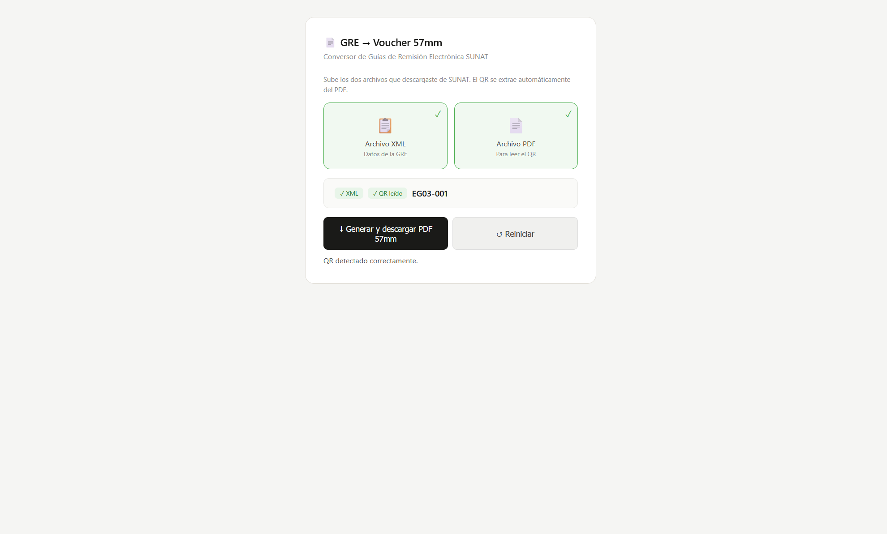

# 📄 Conversor GRE → Voucher 57mm

Herramienta web que convierte **Guías de Remisión Electrónica (GRE)** emitidas por SUNAT (Perú) en un comprobante PDF listo para imprimir en impresoras térmicas portátiles de 57mm — pensado para choferes que necesitan un voucher físico legible en ruta.

**[▶ Ver demo](https://stjsdk.github.io/gre-voucher-57mm/)**



## El problema

En transporte de carga, las GRE se emiten muchas veces de madrugada y los choferes necesitan un comprobante físico compacto para el viaje. Las guías oficiales vienen en PDF tamaño A4, poco práctico para imprimir en una impresora térmica de ticketera dentro del camión. No existía una herramienta lista que tomara los archivos oficiales de SUNAT y generara directamente un voucher angosto (57mm) con toda la información relevante.

## La solución

Una página web autocontenida (sin backend, sin instalación) que:

1. Recibe el **XML** de la GRE (formato UBL `DespatchAdvice` de SUNAT) y opcionalmente el **PDF** oficial.
2. Extrae automáticamente el **código QR de validación** leyendo el PDF (sin necesidad de recortarlo o escanearlo a mano).
3. Parsea los datos relevantes: emisor/transportista, remitente, destinatario, vehículos, conductor, bienes trasladados y documentos relacionados.
4. Genera un **PDF de 57mm de ancho** con layout optimizado para impresoras térmicas, con alto calculado dinámicamente según el contenido (sin espacios en blanco al final).

Todo corre **100% en el navegador** — los datos de la guía nunca salen del dispositivo del usuario.

## Stack técnico

| Librería | Uso |
|---|---|
| [jsPDF](https://github.com/parallax/jsPDF) | Generación del PDF final en formato 57mm |
| [pdf.js](https://mozilla.github.io/pdf.js/) | Lectura del PDF oficial de SUNAT para ubicar el QR |
| [jsQR](https://github.com/cozmo/jsQR) | Decodificación del código QR desde el canvas renderizado |
| [qrcodejs](https://github.com/davidshimjs/qrcodejs) | Reconstrucción del QR como imagen para el voucher final |
| DOMParser / XML nativo | Parsing del XML UBL con soporte de namespaces (`cbc:`, `cac:`) |

### Detalles de implementación que vale la pena resaltar

- **Parsing de XML con namespaces**: SUNAT usa UBL con prefijos (`cbc:ID`, `cac:DespatchSupplierParty`, etc.). Se implementó un helper `byTag()` que busca por `localName` vía `getElementsByTagNameNS('*', name)`, con fallback manual, para que el parser sea agnóstico al namespace exacto.
- **Renderizado en dos pasadas**: el PDF se genera primero en modo "medición" (sin dibujar) para calcular la altura exacta del contenido, y luego en modo "dibujo" con el tamaño de página ya ajustado — así se elimina el espacio en blanco sobrante típico de PDFs de altura fija.
- **Manejo de datos condicionales**: documentos relacionados (ej. guías del remitente), placas secundarias, TUC, y otros campos que solo aparecen en algunas GRE se muestran únicamente si existen en el XML.

## Cómo usarlo

1. Abre `index.html` en cualquier navegador (no requiere servidor ni instalación).
2. Sube el XML de la GRE (obligatorio) y el PDF oficial (opcional, para el QR).
3. Haz clic en **Generar y descargar PDF 57mm**.

## Córrelo localmente

```bash
git clone https://github.com/TU_USUARIO/gre-voucher-57mm.git
cd gre-voucher-57mm
# Simplemente abre index.html en tu navegador, o sirve la carpeta:
python3 -m http.server 8000
```

## Licencia

MIT — libre para usar y adaptar.
